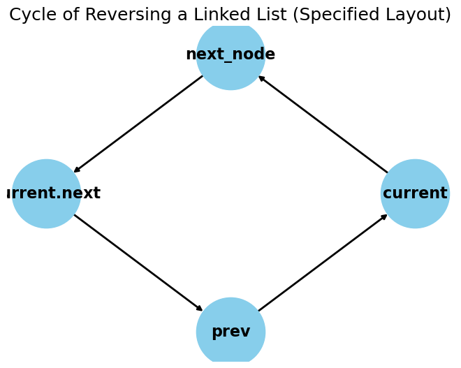

# This is my brain cache on Software Engineer

| Data Structure       | Algorithm              | Concepts                  |
|----------------------|------------------------|---------------------------|
| Linked List          | Breadth-First Search   | Bit Manipulation          |
| Trees, Tries & Graph | Depth-First Search     | Memory (Stack vs Heap)    |
| Stack & Queue        | Binary Search          | Recursion                 |
| Heaps                | Merge Sort             | Dynamic Programming       |
| Vectors/ArrayList    | Quick Sort             | Big O Time and Space      |
| Hash Table           |                        |                           |


# reserve linked list,


```python 
prev = None
current = usuallyParam
while current:
  blah blah blah
return prev
```

think like a pointer, first remove the link of old node, save next and point to the new node, and repeat this process until there are no more next nodes, then you are done.


# Dynamic Programming (Bottom Up)
```python
class Solution:
  def rob(self, nums: List[int]) -> int:
    if len(nums) == 1: 
      return nums[0]
    
    # this is important
    dp = [0] * len(nums)
    # important

    # Base cases
    dp[0] = nums[0]
    dp[1] = max(nums[0], nums[1])
    
    for i in range(2, len(nums)):
      # this is imporatn
      dp[i] = max(dp[i - 1], dp[i - 2] + nums[i]) # Recurrence relation
    
    return dp[-1]

```

# Dynamic Programming (Top-Down)
```python 
class Solution:
  def rob(self, nums: List[int]) -> int:
    def dp(i):
      # Base cases
      if i == 0: 
        return nums[0]            
      if i == 1: 
        return max(nums[0], nums[1])            
      if i not in memo:
        memo[i] = max(dp(i - 1), dp(i - 2) + nums[i]) # Recurrence relation
      return memo[i]
    memo = {}
    return dp(len(nums) - 1)
```

* this most important of dynamic programming is the based case, then the hashmap in python just use `{}` and it will be okay, then the hardest part is the compute part with in above case is the `max(a,b)`, this is just an example but bear in mind, Bottom-up have loop Top-Down dont, 